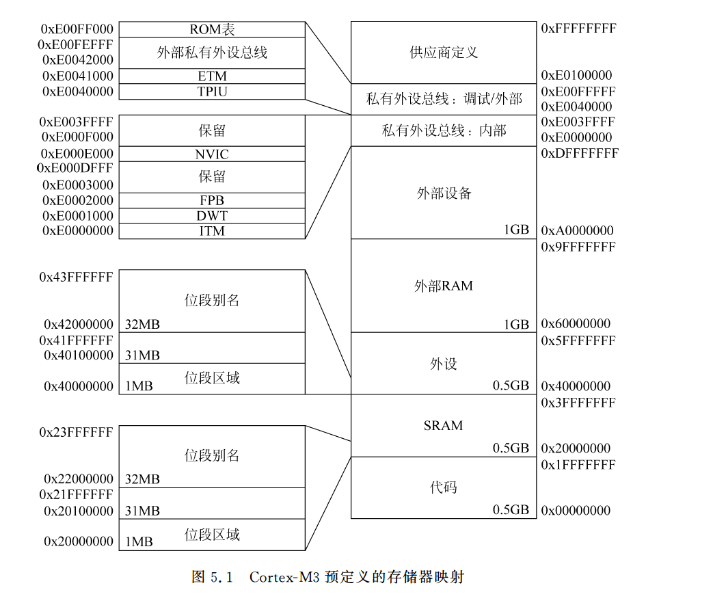
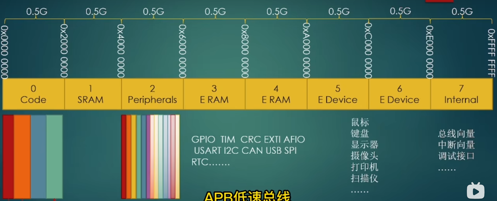
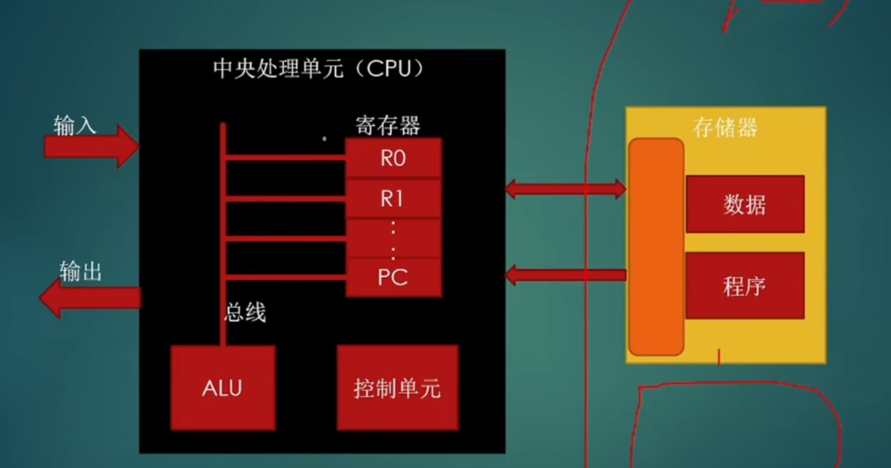
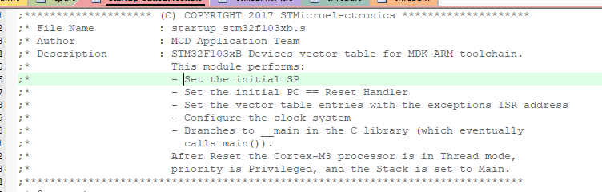
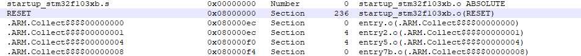
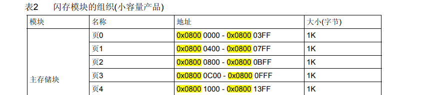
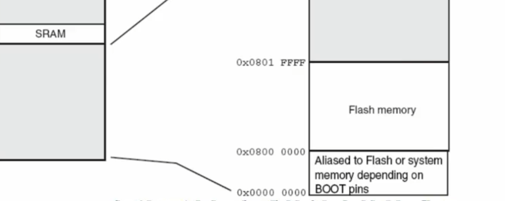
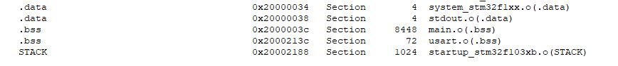

# stm32单片机运行原理
## 存储器系统


### 基础知识
1. 存储器类型
```
    ARM处理器支持多种类型的存储器，它们的功能和访问速度各不相同：
    
    ROM（只读存储器）：主要存放固化的程序代码，比如引导程序、固件等。不能修改，但可以读取。
    RAM（随机存取存储器）：用于存放程序运行时的临时数据和堆栈，数据可以读写，掉电后数据会丢失。
    闪存（Flash）：一种非易失性存储器，常用于存储程序和配置数据。可以擦写。
```
2. 存储器模型
```
    ARM的存储器模型决定了处理器如何访问和组织存储器。常见的模型包括：
    
    哈佛结构（Harvard Architecture）：指令存储器和数据存储器分开，CPU可以并行读取指令和数据，从而提高性能。
    
    冯·诺依曼结构（Von Neumann Architecture）：指令和数据存储在同一个存储器中，CPU需要在指令和数据访问之间进行切换。
    
    ARM Cortex-M系列的微控制器通常采用哈佛结构，而高级的Cortex-A系列处理器常采用更复杂的混合模型。
```
3. 内存映射（Memory Mapping）
```dotnetcli
    ARM处理器将外部设备和存储器映射到同一个地址空间中，即所有的外设和存储器通过地址来访问。这种方式简化了存储器和外设的访问。内存映射通常包括以下部分：
    
    代码区：存放程序代码，通常在Flash存储器中。
    堆栈区：用于存放函数调用的堆栈信息。
    堆区：用于动态内存分配。
    外设区：映射到处理器的外部设备，比如UART、SPI、GPIO等。
```

4. 存储器管理单元（MMU）
```
    在高性能的ARM处理器（如Cortex-A系列）中，MMU用于管理虚拟内存和物理内存之间的映射。它通过页表来控制内存访问权限和地址转换，以支持操作系统的虚拟内存机制。        
```

5. 内存保护单元（MPU）
```
    Cortex-M系列的处理器通常不带有MMU，而是使用MPU来管理存储器访问。MPU主要用于定义不同区域的访问权限和属性，如只读、可执行等，从而防止错误访问，提升系统的安全性。
```

### 程序代码可以位于不同的存储器区域
1. 代码区（Code Region）
代码区通常位于**闪存（Flash Memory）**中，这是嵌入式系统中最常见的存储程序代码的位置。
程序代码被烧录到Flash中，这种非易失性存储器可以在掉电后保留数据，因此适合存储程序。
一般来说，嵌入式系统的**引导加载器（Bootloader）**和应用程序代码都在代码区。
2. 静态随机访问存储器（SRAM）区域
SRAM 是一种易失性存储器，掉电后数据会丢失，通常用于存储临时数据和堆栈。
在某些系统中，为了加快程序的执行速度，部分或全部程序代码可以从Flash拷贝到SRAM中运行，因为SRAM的访问速度比Flash更快。
尽管SRAM主要用于数据存储，但一些嵌入式系统设计中，也会允许程序代码在SRAM中执行。
3. 外部RAM区域（External RAM Region）
外部RAM（如外部的SDRAM或SRAM）通常用于扩展系统的内存容量，尤其是当片上SRAM不够时。
某些情况下，程序代码可以被加载到外部RAM中并执行，特别是在需要执行较大程序时。
外部RAM一般比片上存储器更慢，但某些系统会采用缓存技术或其他手段来提升性能。
结论：
代码区 是最常见的存储程序代码的地方，尤其是使用非易失性存储（如Flash）。
    SRAM 主要用于数据存储，但在特定场景下也可以运行代码。
外部RAM 可以用来执行较大程序，尤其是在需要更多内存时，但一般速度比SRAM或Flash慢。
你可以根据系统性能需求和内存容量来决定程序代码的存放位置。
### 片上外设
地址区域的另外0.5GB的块用于片上外设，和SRAM区域类似，该区域也支持位段别名而且可以通过系统接口访问，不过，其不支持指令执行。由于外设区域支持位段特性，外设的控制和状态位的修改会非常简单，对外设控制的编程也就更加简单了。
### 外部RAM和外部设备
外部RAM和外部设备分别具有1GB的存储器空间，这两块的区别为外部设备空间不允许程序执行，并且在缓存的处理上也有所不同。

### 0.5GB用于系统级部件（一般看不到）
由于外设区域支持位段特性，外设的控制和状态位的修改会非常简单，对外设控制的编程也就更加简单了。

外部RAM和外部设备分别具有1GB的存储器空间，这两块的区别为外部设备空间不允许程序执行，并且在缓存的处理上也有所不同。

最后的0.5GB用于系统级部件、内部外设总线、外部外设总线和供应商特定的系统外设。私有外设总线(PPB)包括两个部分：

高级高性能总线(AHB)PPB，仅用于Cortex-M3的内部AHB外设，包括NVIC、 FPB、DWT和ITM；
高级外设总线(APB)PPB,用于Cortex-M3的内部APB设备以及外部外设(Cortex- M3处理器外部)，Cortex-M3允许供应商在私有外设总线上添加额外的经由APB接口的片上APB外设。

#### PPB外设介绍
私有外设总线（PPB，Private Peripheral Bus） 是 ARM Cortex-M 系列处理器中用于访问处理器内部一些关键的控制和调试功能的特殊总线。PPB 是连接处理器内核与内置的特殊外设（如调试和系统控制模块）的通道，用于控制处理器内部状态以及调试功能。

PPB 的主要特点与作用：
1. 专门用于处理器控制和调试：
```dotnetcli
PPB 主要用于访问处理器内核内部的控制寄存器和调试相关的外设，如：
系统控制块（SCB, System Control Block）：用于系统异常处理和控制。
嵌入式调试模块（DWT, Debug Watch and Trace）：用于调试和跟踪程序执行。
嵌入式中断控制器（NVIC, Nested Vectored Interrupt Controller）：处理中断。
```
2. 系统定时器（SysTick Timer）：提供系统定时功能。
```
这些功能通过 PPB 总线进行管理，确保处理器内部的调试和系统控制外设不与一般外设的总线混合。
特殊的内存映射区域：

在 ARM Cortex-M 架构中，PPB 是通过专门的内存地址空间映射的，这些地址通常位于特定的内存区域，例如：
PPB 地址通常位于 0xE0000000 - 0xE00FFFFF 之间，属于 Cortex-M 的外设空间的一部分。
通过访问这个地址空间，开发者可以控制与调试、系统管理、异常处理等相关的寄存器。
```
3. 与常规外设总线分离：
```
PPB 专门用于处理与处理器核心相关的操作，并且与常规的外设总线（用于访问 GPIO、UART、SPI 等外设）是分离的。这种设计提高了系统的安全性和管理效率，确保调试操作与应用操作不冲突。
```
4. 调试与跟踪功能：
```
PPB 提供对调试器所需功能的访问，允许开发者通过硬件调试工具控制处理器状态，设置断点，查看寄存器等。
PPB 访问调试器模块，如调试访问端口（DAP，Debug Access Port）和跟踪控制模块（Trace Control），使得调试和跟踪 ARM Cortex-M 处理器的执行变得更加简便。
```
5. 系统控制与异常管理：
```
通过 PPB 可以访问系统控制块（SCB），该模块管理诸如异常优先级、复位、系统中断等操作。
处理器的复位和时钟配置、异常向量表的地址设置等，都通过 PPB 控制。
```
    


这张图记录了关系栈，堆，数据，程序的问题

## 分析stm32的启动文件

### 启动文件做了什么？
1. Set the initial SP 堆栈和堆内存配置
```csharp
Stack_Size		EQU     0x400

                AREA    STACK, NOINIT, READWRITE, ALIGN=3
Stack_Mem       SPACE   Stack_Size
__initial_sp


; <h> Heap Configuration
;   <o>  Heap Size (in Bytes) <0x0-0xFFFFFFFF:8>
; </h>

Heap_Size      EQU     0x200

                AREA    HEAP, NOINIT, READWRITE, ALIGN=3
__heap_base
Heap_Mem        SPACE   Heap_Size
__heap_limit
```
2. 中断向量表
```csharp
__Vectors       DCD     __initial_sp               ; 堆栈顶指针
                DCD     Reset_Handler              ; 复位处理程序
                DCD     NMI_Handler                ; 非屏蔽中断处理程序
                DCD     HardFault_Handler          ; 硬故障处理程序
                DCD     MemManage_Handler          ; 存储管理故障处理程序
                DCD     BusFault_Handler           ; 总线故障处理程序
                DCD     UsageFault_Handler         ; 用法故障处理程序

```
异常和中断处理函数,比如：
```csharp
; Reset handler
Reset_Handler    PROC
                 EXPORT  Reset_Handler             [WEAK]
     IMPORT  __main
     IMPORT  SystemInit
                 LDR     R0, =SystemInit
                 BLX     R0
                 LDR     R0, =__main
                 BX      R0
                 ENDP

```
这个也是复位处理程序 
在系统复位时，Reset_Handler 会首先执行，它会调用 SystemInit 初始化系统时钟等外设，然后调用 __main，进入 C 库的启动代码，最后执行用户的 main() 函数。
除了这中断处理函数，对于一些外设中断，文件定义了默认的处理程序，如：WWDG_IRQHandler PVD_IRQHandler  等等

6. 栈和堆初始化：
在文件的尾部，定义了 __user_initial_stackheap，它设置了栈和堆的起始地址，具体实现如下：
```csharp
__user_initial_stackheap
                 LDR     R0, =  Heap_Mem
                 LDR     R1, =(Stack_Mem + Stack_Size)
                 LDR     R2, = (Heap_Mem +  Heap_Size)
                 LDR     R3, = Stack_Mem
                 BX      LR
```

1. 中断执行函数存储在 Flash 的 代码区，这也是程序存储器的区域，例如在 0x08000000 后续地址（取决于程序大小）。这一区域用来存储用户编写的中断服务函数和其他代码。

2. 默认情况下，中断向量表存储在 Flash（程序存储器） 的起始地址处，STM32F1 系列的中断向量表默认地址是：起始地址：0x08000000 （Flash 的起始地址）

## .map文件分析
.map 文件是链接器生成的输出文件，用于描述程序在内存中的布局和资源分配。它包含了有关代码段、数据段、堆栈和其他资源的详细信息。
1. 章节交叉参考 Section Cross References
文集的包含关系

2. 从图像中删除未使用的输入部分。 Removing Unused input sections from the image.

总结一共移除多少
```dotnetcli

239 unused section(s) (total 12024 bytes) removed from the image.
```
3. Local Symbols 当地的符号


可以看到我们的启动文件，为什么是0x0800 0000了？



还有，我们只发现了栈，但是没有堆

这是为什么了?
因为我们没有用过堆，所以编译器没编译
  Removing startup_stm32f103xb.o(HEAP), (512 bytes).