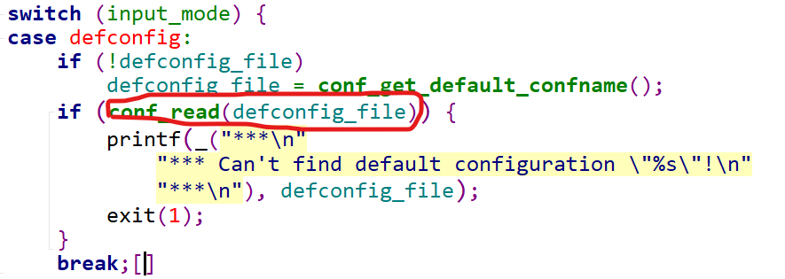

#  默认编译

可见，当我们使用make mx6ull_14x14_evk_emmc_defconfig时，会产生.config。我复制下来，就是config文件。
将他和mx6ull_14x14_evk_defconfig相比，可见它比配置文件多了不少。<br>

后来，有make mx6ull_14x14_evk_emmc_defconfig >1.txt来看看配置的时候到底发生了什么?
<br>


## 如何生成.config
### 查找mx6ull_14x14_evk_emmc_defconfig
1. 
```makefile
mx6ull_14x14_evk_emmc_defconfig: scripts/kconfig/conf
	$(Q)$< $(silent) --defconfig=arch/$(SRCARCH)/configs/$@ $(Kconfig)

```
可知：
    

    ```makefile
    $<:scripts/kconfig/conf
    $(silent):不知道(无定义，为空)
    $(SRCARCH):..
    SRCARCH := ..
    $@:mx6ull_14x14_evk_emmc_defconfig
    $(Kconfig)；
    Kconfig := Kconfig
    ```


所以:
    $(Q) $< $(silent) --defconfig=arch/$(SRCARCH)/configs/$@ $(Kconfig)
    等于：scripts/kconfig/conf  --defconfig=arch/../configs/mx6ull_14x14_evk_emmc_defconfig    Kconfig
2. 将‘scripts/kconfig/conf  --defconfig=arch/../configs/mx6ull_14x14_evk_emmc_defconfig    Kconfig’带入，ubuntu

显示UBOOTVERSION,也就是UBOOT版本号未定义
```makefile

UBOOTVERSION = 2016.03
```
3. 将“UBOOTVERSION=2016.03 scripts/kconfig/conf  --defconfig=arch/../configs/mx6ull_14x14_evk_emmc_defconfig    Kconfig’带入，ubuntu
 
生成了.config


*********结论*********
*********结论*********
*********结论*********：
使用“UBOOTVERSION=2016.03 scripts/kconfig/conf  --defconfig=arch/../configs/mx6ull_14x14_evk_emmc_defconfig    Kconfig’可以生成.config,但是要依靠scripts/kconfig/conf 文件

### 分析scripts/kconfig/conf 文件
1. 查找scripts/kconfig/conf
```makefile
scripts/kconfig/conf: FORCE scripts/kconfig/conf.o scripts/kconfig/zconf.tab.o
	$(call if_changed,host-cmulti)
```
查找scripts/kconfig/conf.o

```makefile
scripts/kconfig/conf.o: scripts/kconfig/conf.c FORCE
	$(call if_changed_dep,host-cobjs)
```
查找scripts/kconfig/zconf.tab.o
```makefile
scripts/kconfig/zconf.tab.o: scripts/kconfig/zconf.tab.c FORCE scripts/kconfig/zconf.lex.c scripts/kconfig/zconf.hash.c
	$(call if_changed_dep,host-cobjs)
```
结论：scripts/kconfig/conf，需要使用scripts/kconfig/conf.c和cripts/kconfig/zconf.tab.c

2. 打开scripts/kconfig/conf.c和scripts/kconfig/zconf.tab.c文件


scripts/kconfig/conf.c 使用的头文件，如下：
```c
#include <locale.h>
#include <ctype.h>
#include <stdio.h>
#include <stdlib.h>
#include <string.h>
#include <time.h>
#include <unistd.h>
#include <getopt.h>
#include <sys/stat.h>
#include <sys/time.h>
#include <errno.h>

#include "lkc.h"
```


scripts/kconfig/zconf.tab.c使用的头文件，如下：
```c
#include <ctype.h>
#include <stdarg.h>
#include <stdio.h>
#include <stdlib.h>
#include <string.h>
#include <stdbool.h>

#include "lkc.h"
```
可见，scripts/kconfig/conf.c和scripts/kconfig/zconf.tab.c文件应用了各种头文件，为了方便期间我把scripts/kconfig下的所有文件都复制下来，放到Source Insight 4.0中分析。

### 分析scripts/kconfig中的文件(就是此目录下的kconfig文件)

1. 查看函数先从conf.c的main函数看起

看看我们传入的参数

在main函数中我们看到一个分类


进行查找得到
我们选择的是地四个，默认的配置


我们可知L:
```c
case defconfig:
		case savedefconfig:
			defconfig_file = optarg;
			break;
```

optarg——指向当前选项参数（如果有）的指针。
optind——再次调用 getopt() 时的下一个 argv 指针的索引。
optopt——最后一个未知选项。


结论：defconfig_file=arch/../configs/mx6ull_14x14_evk_emmc_defconfig 

2. 接着往下看


可知： name=Kconfig,并且使用了conf_parse(name)函数
        conf_parse(name)函数//解析uboot根目录下的Kconfig文件

3. 接着看
   

   conf_read(defconfig_file)使用此函数读配置文件

4. 结束
   
   使用conf_write(NULL)函数，写到.config


*********结论*********
*********结论*********
*********结论*********：
Kconfig是一个通用文件，里面规定了一些依赖，比如：
    1.如果是ARM架构，就默认选中A,B,C配置
    2.如果是RISC-V架构，就默认选中a,b,c配置

defconfig_file：这是厂家提供的，里面定义了
    1.ARM架构
    2.自己的一些配置

怎么处理了？
    1.defconfig_file:直接写入.config
    2.使用defconfig_file的内容去解析Kconfig，把各个依赖的配置也写入到.config
    3.其他未涉及的配置项，给他们指定默认值

这样解释了，为什么生成的配置文件.conf会比mx6ull_14x14_evk_defconfig多一些内容。
