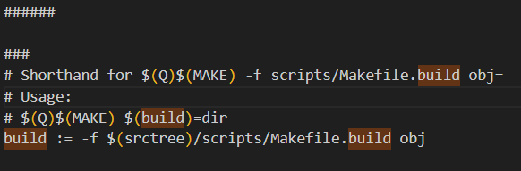

# uboot如何编译的


## 大体认识
### 使用make distclean时
当我们使用make distclean命令的时候，可以看到clean config.h


### 使用make命令
1. 首先编译的是config.h

2. 接着是一种工具
   
3. 然后，就是arch架构
   
4. 最后是驱动设备
    
5. 最最后是这个
 


 ## 详细分析
 ### .config去哪里了
 1. 打开config.h
   

   /* Automatically generated - do not edit */
   自动生成不要去编译它

说明，他是自动生成的，可能和.config文件关系不大


2. 利用.config内容，查看谁应用了它

因为.config 里面有"CONFIG_ARCH_MX6=y"
所有查看谁编译了它


最后发现在autoconf.h和u-boot.cfg中(因为#define CONFIG_ARCH_MX6 1，别人都是=y)


3. 打开autoconf.h
   

   这是C语言语法，只要是在.config文件中被选中的，都变成了 1

4. 打开u-boot.cfg
   
   发现和autoconf.h的内容大部分相同

5. 于是，我们看看谁使用了u-boot.cfg
   
   
   我们去Makefile里面去看看，有关u-boot.cfg的内容

6. u-boot.cfg的内容，如下；
    
    u-boot.cfg依赖于config.h

```yml

```

    (这就有意思了)我们刚在config.h中找.config的关系，没有发现。
    于是从“利用.config内容，查看谁应用了它”出发，找到u-boot.cfg和autoconf.h。
    发现u-boot.cfg和autoconf.h几乎相同，且u-boot.cfg依赖于config.h
    故：我们有理由怀疑config.h的应用了autoconf.h

7. 谁用了autoconf.h(和config.h的关系)
   
Kconfig.h里面有autoconf.h，config.h里面有Kconfig.h。
说明，我们的怀疑是对的


*********结论*********
*********结论*********
*********结论*********：
.config被编译成了一个类似于Kconfig.h的文件，使用的是C语言的宏定义
如下：
3. 打开autoconf.h
   


### autoconf.h如何被引用的？？
1. 查看common/Makefile文件
   内容如下：
2 


### 小汇总


*********结论*********
*********结论*********
*********结论*********：
     u-boot.cfg 减去 autoconf.h = 来自头部的文件配置
   

## 如何生成config.h

开启我们对于makefile文件的分析，以config.h，autoconf.h等头文件为抓手

1. 在u-boot的Makefile里面，查找config


```makefile
# Read in config
-include include/config/auto.conf

# Read in dependencies to all Kconfig* files, make sure to run
# oldconfig if changes are detected.
-include include/config/auto.conf.cmd

# To avoid any implicit rule to kick in, define an empty command
$(KCONFIG_CONFIG) include/config/auto.conf.cmd: ;

# If .config is newer than include/config/auto.conf, someone tinkered
# with it and forgot to run make oldconfig.
# if auto.conf.cmd is missing then we are probably in a cleaned tree so
# we execute the config step to be sure to catch updated Kconfig files
include/config/%.conf: $(KCONFIG_CONFIG) include/config/auto.conf.cmd
	$(Q)$(MAKE) -f $(srctree)/Makefile silentoldconfig
	@# If the following part fails, include/config/auto.conf should be
	@# deleted so "make silentoldconfig" will be re-run on the next build.
	$(Q)$(MAKE) -f $(srctree)/scripts/Makefile.autoconf || \
		{ rm -f include/config/auto.conf; false; }
	@# include/config.h has been updated after "make silentoldconfig".
	@# We need to touch include/config/auto.conf so it gets newer
	@# than include/config.h.
	@# Otherwise, 'make silentoldconfig' would be invoked twice.
	$(Q)touch include/config/auto.conf


```

*********先上结论*********
*********先上结论*********
*********先上结论*********：
由“-include include/config/auto.conf”，根据makefile的语法规则，
在执行make的第一个目标之前，先生成auto.conf文件。即，include/config/%.conf: $(KCONFIG_CONFIG) include/config/auto.这命令。

   1. $(Q)$(MAKE) -f $(srctree)/Makefile silentoldconfig
   将生成auto.conf文件
   2. $(Q)$(MAKE) -f $(srctree)/scripts/Makefile.autoconf || \
		{ rm -f include/config/auto.conf; false; }
      将生成include/config.h  u-boot.cfg  include/autoconf.mk


如何分析了， $(Q)$(MAKE) -f $(srctree)/Makefile silentoldconfig，
这句话的意思是，利用Makefile来执行silentoldconfig。故约等于make silentoldconfig

2. 深入分析这两条命令
   使用make silentoldconfig命令
   
   分析可得到，它生成了一个kconfig文件（说明编译silentoldconfig需要kconfig文件）

3. 去Makefile里面找kconfig
   
   重点看这个命令  
   ```makefile
    %config: scripts_basic outputmakefile FORCE
	$(Q)$(MAKE) $(build)=scripts/kconfig $@   
   ```
    1. %config=silentoldconfig

    2. 那$(build)是什么意思了，我在顶层Makefile里面没有找到，百度后发现
     
     那去scripts\kbuild里面看看
     终于找到了
    

    3. (build)=scripts/kconfig等于
   -f $(srctree)/scripts/Makefile.build obj=scripts/kconfig 

    ********结论*********
    *********结论*********
    *********结论*********：
    $(Q)$(MAKE) $(build)=scripts/kconfig $@  等于
    make -f $(srctree)/scripts/Makefile.build obj=scripts/kconfig   silentoldconfig
    说明makefile 用scripts/Makefile.build来生成kconfig，来生成silentoldconfig

4. 现在我们已经知道uboot如何审查silentoldconfig，也就是老配置文件了
   

  

   

 

 