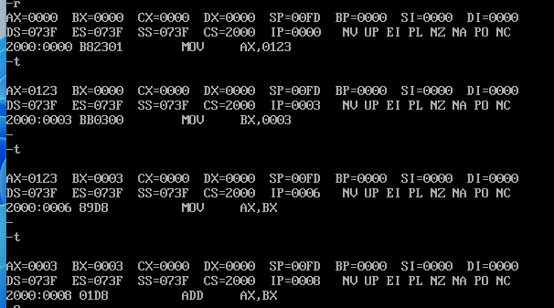

CS:代码段寄存器
ip:指令指针寄存器
CS:IP  ：CPU将内存中的CS:IP指向的内容当做指令来执行

1. 下图是在2000:0位置，存放的指令

2.当CS:IP为2000:0时，代码可以工作
并且IP=IP+所读取的指令的长度，从而指向下一个指令。

问题：对于内存中的数据，CPU是当成一般数据来看，还是用作指令来看了？

答：CPU将CS:IP指向的内存单元中的内容看成指令！！