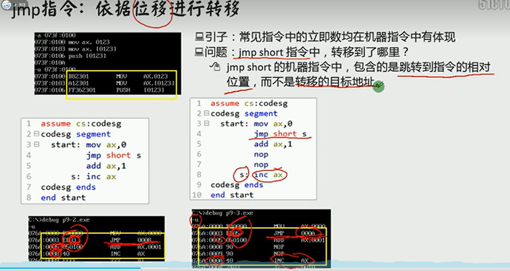

# jmp指令小结

|jmp指令格式|示例|
|:--:|:--:|
|jmp标号|1. 段间转移(远转移):jmp far ptr标号------------------    2段内段转移：jmp short 标号 8位的位移；-------3段内近转移：jmp near ptr 标号；16位的位移   |
|jmp  寄存器|-jmp bx:16位的位移|
|jmp内存单元(表示跳转到的地址)|-段内转移：jmp word ptr 内存单元地址;ptr word ptr[bx]------------------------------------------------------------段间转移:jmp dword ptr内存单元地址:jmp dword ptr [bx]|

        