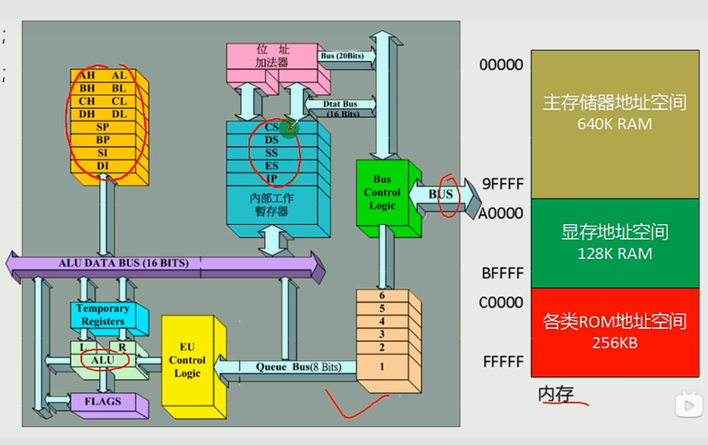

# CPU的组成

## 寄存器式CPU内部的信息存储单元
8060cpu有14个寄存器：
1. 通用寄存器：AX BX,CX,DX
2. 变址寄存器：SI,DI
3. 指令寄存器：SP BP
4. 指令指针寄存器：IP
5. 段寄存器：CS SS DS ES
6. 标志位寄存器： PSW
   
共性：
    8060CPU所有的寄存器都是16位的，可以存放两个字节。

## 如何保证兼容性
通用寄存器可以风味两个独立的8位寄存器使用

细化： AX可以分为AH和AL
