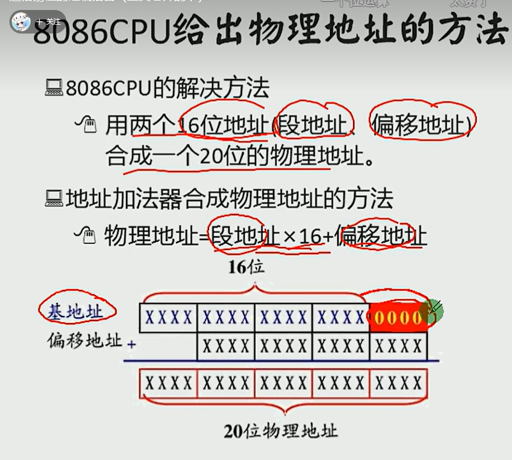

# 物理地址
CPU访问内存单元时要给出内存段元的地址，
8060有20位的地址线，可以传送20位地址，（寻址能力位1M）
但是，8060是16位结构的CPU

问题：8060如何处理在寻址空间上的矛盾

用两个16位地址（段地址，偏移地址）相加得到一个20位的物理地址。

本质含义：
CPU在访问内存时，有一个基础地质（段地址X16）和一个相对于基础地址的偏移地址相加，给出内存单元的物理地址

