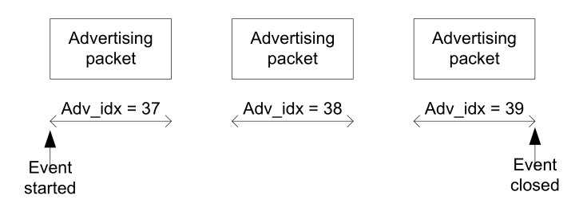
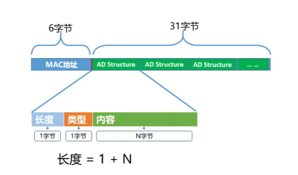
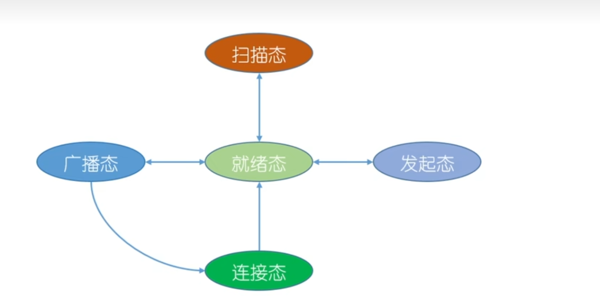
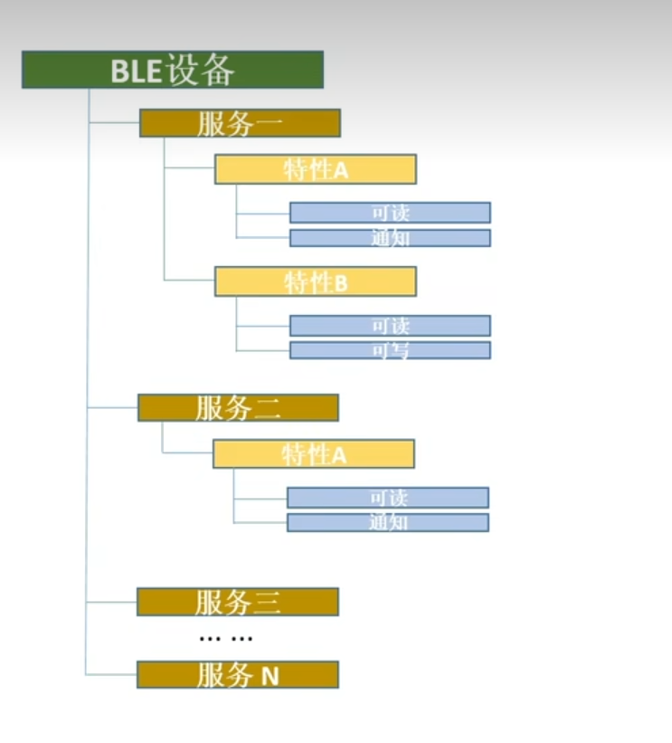

# 低功耗蓝牙
蓝牙是一种近距离无线通信技术，运行在2.4GHz免费频段，目前已大量应用于各种移动终端，物联网，健康医疗，智能家居等行业。蓝牙4.0以后的版本分为两种模式，单模蓝牙和双模蓝牙。

单模蓝牙，即低功耗蓝牙模式，是蓝牙4.0中的重点技术，低功耗，快连接，长距离。
双模蓝牙，支持低功耗蓝牙的同时还兼容经典蓝牙，经典蓝牙的特点是大数据高速率，例如音频、视频等数据传输。

# BLE工作流程
## 广播
广播是指从机每经过一个时间间隔发送一次广播数据包，这个时间间隔称为广播间隔，这个广播动作叫做广播事件，只有当从机处于广播状态时，主机才能发现该从机。
在每个广播事件中，广播包会分别在37,38和39三个信道上依次广播，如下图所示。


另外BLE链路层会在两个广播事件之间添加一个0~10ms的随机延时，保证多个设备广播时，不会一直碰撞广播。也就是说，设置100ms的广播间隔，实际上两次广播事件的时间间隔可能是100~110ms之间的任意时间。


## 扫描响应
没啥说的


## 服务与特性

UUID是 University Unique Identifie 的缩写，翻译成中文为 通用唯一标识符。是蓝牙组织联盟定义的用于区分蓝牙服务和特性的的标识符，总长度为128 Bit。
```
服务和特性特创建
蓝牙设备要在进入广播态之前创建服务和特性，在MicroPython中大概分为四步：
创建要使用的UUID；
使用UUID创建特性并设置特性的读写权限；
将创建好的特性添加到服务集合中；
 将服务集合注册到协议栈中。
```

### 数据收发
1. read
2. write
3. write with no response
4. notify
5. indicate

使用的是Read方法，手机发送数据给蓝牙模块使用的是Write方法，蓝牙模块发送数据到手机，一般使用的是Notify方法，而且手机端还要打开Notify监听。